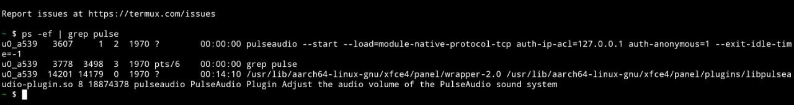
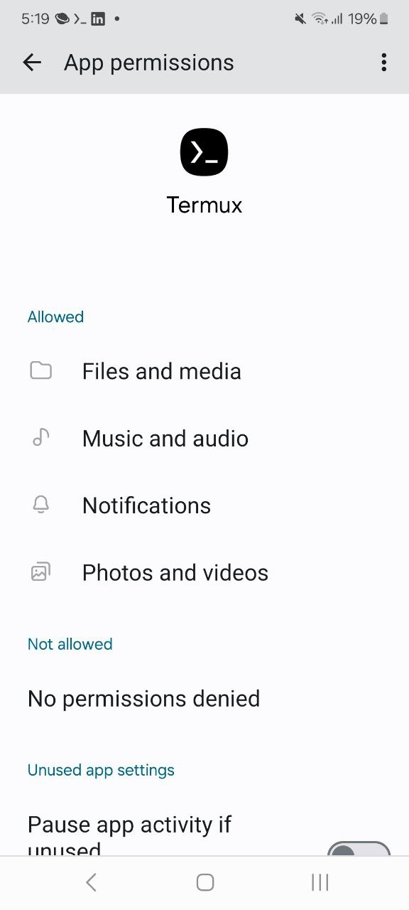
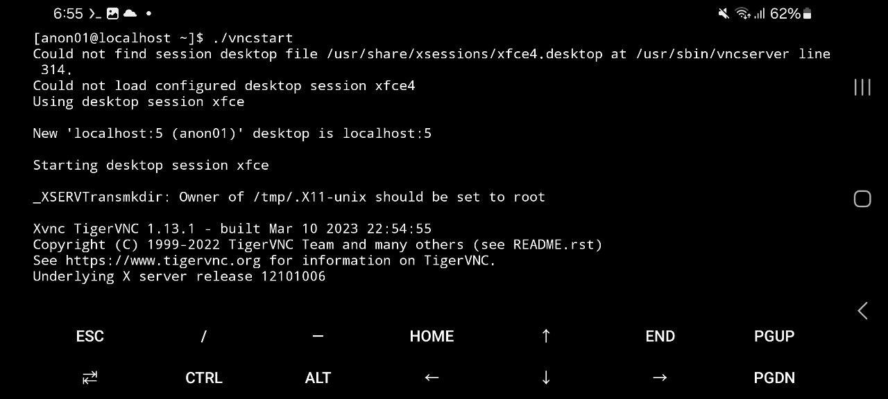
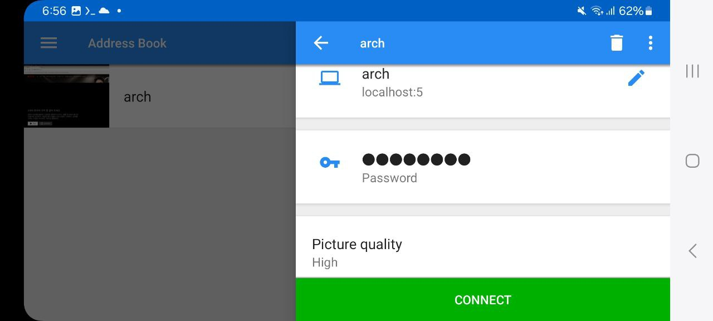
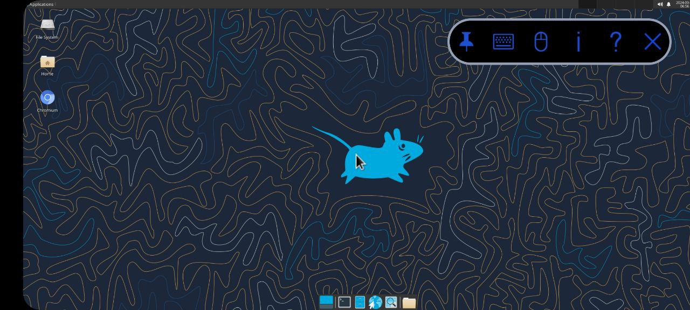
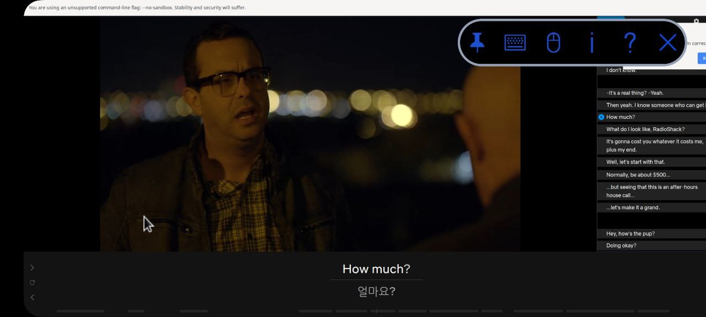

# 핸드폰에서 Netflix로 영어공부하기 w/ Language Reactor

우리가 pc에서는 Language Reactor라는 extension을 깔아서 크롬브라우저에서 netflix로 영어공부를 했었는데 모바일 환경에서는 불가능했다.
이유는 widevine 라이브러리가 없어서임.  

유튜브에 만드는 과정을 올린적이 있는데, 따라하기 쉽지않아 몇몇 분들이 고생함.  
그래서 그냥 다 된것을 공유하기로 함 

Termux만 폰이나 테블릿에 깔아놓고 내가 공유한 widevine패치된 archlinux 압축을 풀어서 모바일환경에서 netflix with language reactor를 통한 영어공부를 맘껏 하는 것이 목표임 


## 먼저 termux를 핸드폰에 깐다.
플레이스토어에서 설치하지 말고 F-Droid를 통해서 인스톨 하던지 아니면 아래 링크를 통해서 apk를 다운받아서 설치하면 된다. 
https://f-droid.org/ko/packages/com.termux/
**꼭 0.118.0 버전**이다. 상위버전에서는 제대로 동작하지 않을수 있다.  
위 링크에 0.118.0 버전이 없다면 아래에서 apk를 다운받는다.  
https://drive.google.com/file/d/1Xwk7joLUcnS_E43sJ9YUZctnMMPxoI8w/view?usp=drivesdk


이제 termux로 들어가서 아래 package를 인스톨한다.
```
pkg install proot proot-distro pulseaudio vim
```

그리고 아래처럼 두개의 파일 **.profile**, **start-arch.sh** 을 만든다.  
아래처럼 echo 를 이용해서 파일을 만들어도 되겠다. 바로 copy해서 termux 에서 실행(~$ 위치에서)하면 파일이 만들어진다.
```
echo '[ -f /system/lib64/libskcodec.so ] && LD_PRELOAD=/system/lib64/libskcodec.so' > .profile
echo 'killall pulseaudio 2> /dev/null' >> .profile
echo 'pulseaudio --start --load="module-native-protocol-tcp auth-ip-acl=127.0.0.1 auth-anonymous=1" --exit-idle-time=-1' >> .profile
echo 'pacmd load-module module-native-protocol-tcp auth-ip-acl=127.0.0.1 auth-anonymous=1' >> .profile
echo 'PROOT_ASSUME_NEW_SECCOMP=1 proot-distro login --user anon01 archlinux' > start-arch.sh
chmod a+x .profile start-arch.sh
```

vi나 nano를 이용하여 편집해도 되겠다. 편한 방식으로 하심 될듯.  
**.profile**
```
[ -f /system/lib64/libskcodec.so ] && LD_PRELOAD=/system/lib64/libskcodec.so
killall pulseaudio 2> /dev/null
pulseaudio --start --load="module-native-protocol-tcp auth-ip-acl=127.0.0.1 auth-anonymous=1" --exit-idle-time=-1
pacmd load-module module-native-protocol-tcp auth-ip-acl=127.0.0.1 auth-anonymous=1 
```
**start-arch.sh**
```
PROOT_ASSUME_NEW_SECCOMP=1 proot-distro login --user anon01 archlinux
```
둘다 실행권한이 있어야 하기에 아래 명령어도 꼭 실행해준다.
```
chmod a+x .profile start-arch.sh
```

잘 되었는지 확인해보자.  
termux에서 exit로 logout 한후 다시 termux를 클릭하여 들어온다.
```
ps -ef 
```
다시 들어와서 위 명령어를 실행했을때 `pulseaudio --start --load ...` 하는 부분이 보이는지 체크한다. 보이면 지금까지 이상이 없는것이다.



## 아래 archlinux 이미지를 다운받아서 압축 푼다.
https://drive.google.com/file/d/1TVPeRpRJZ2pBlUPGQyCobWEe07SEzz-d/view?usp=drivesdk

2.4기가 정도 된다. 다운을 잘 되었다면 아마도 Download/폴더에 있을것인데 이를 termux상에서 아래 위치로 옮긴다. 
Termux에서 핸드폰상의 파일들은 `storage/`를 통해서 접근가능한다. 
먼저 아래대로 이동후 archlinux가 들어갈 폴더 생성
```
cd /data/data/com.termux/files/usr/var/lib/
mkdir -p proot-distro/installed-rootfs
```
아마도 proot-distro를 통해 리눅스를 설치한적이 없기 때문에 해당 폴더가 존재하지 않았을 것이다.
이제 widevine패치가 들어간 archlinux proot 이미지를 Download에서 옮기고 압축해제한다.  
여기서 주의할 점은 termux에 안드로이드 파일시스템에 접근할 권한이 있어야 한다는 것이다. 아래처럼 모든 권한이 다 들어가 있는지 먼저 확인한다.  

권한이 올바르게 설정이 되었다면 아래 명령 실행

```
cd /data/data/com.termux/files/usr/var/lib/proot-distro/installed-rootfs
mv /storage/emulated/0/Download/proot-widevine-patched-archlinux-202503.tar.gz .
tar -xvzf proot-widevine-patched-archlinux-202503.tar.gz
```

`/storage/emulated/0/`아래가 핸드폰의 internal storage이다.
에러없이 압축이 다 풀렸다면 거의 끝났음.
exit치고 termux에서 나갔다가 다시 들어온다.


## archlinux 시작시킨다.
termux에 다시 들어와서 아래 명령으로 archlinux 시작
```
./start-arch.sh
```

미리 만들어놓은 계정의 이름은 `anon01`이고, password가 필요없는 sudo권한이 들어가 있다.  
vnc던 anon01이든 password를 물어보면 먼가 설정이 틀린것이다.

이제 vnc server시작시킨다.
```
./vncstart
```


아래 내용은 참고로 알아두는 편이 좋다.
vncserver의 설정파일은 home 디렉토리 (/home/anan01) 밑에 .vnc라는 폴더이다. 여기에 `config`파일에 해상도를 지정할수가 있다.
본인 디바이스에 맞는 해상도를 적어준다.
vcnserver의 주소는 `localhost:5` 이다.
vnc viewer로 연결할때 password는 필요하지 않다. 

## 안드로이드에서 vnc viewer를 실행한다.
연결할 서버 주소는 `localhost:5`로 하고 image quality는 high로 지정해준다.


바탕화면에 있는 chromium 을 클릭하여 브라우저를 띄우고 netflix에 로그인. 컨텐츠를 클릭하면 language reactor가 동작하는것을 볼수 있다.




## 기타 ETC
### Pantom process kill 방지하기
안드로이드 시스템이 백그라운드에서 동작중인 termux를 phantom process로 간주하여 강제로 kill할 수가 있다. 이를 방지하기 위해서 아래 스크립트를 최초 한번은 실행해준다. 한번만 해주면 다시 할 필요없다. Android13일때 부터 이랬는데 최근에도 마찬가지로 아래과정을 해주어야지 process kill을 막을수 있다.

먼저 termux에서 전체 pkg를 update한다.
```
pkg update; pkg upgrade
```
adb을 설치한다.
```
pkg install android-tools
```
이제 아래처럼 ppkd.sh를 만들어준다.
```
cat <<END > ppkd.sh
######## check status #######
echo -n "global settings_enable_monitor_phantom_procs "
adb shell settings get global settings_enable_monitor_phantom_procs
echo -n "activity_manager max_phantom_processes "
adb shell "/system/bin/device_config get activity_manager max_phantom_processes"

#########  disable phantom process kill ######
echo ...disabling...
adb shell "/system/bin/device_config set_sync_disabled_for_tests persistent"
adb shell "/system/bin/device_config put activity_manager max_phantom_processes 2147483647"
adb shell settings put global settings_enable_monitor_phantom_procs false

######## check status again #######
echo -n "global settings_enable_monitor_phantom_procs "
adb shell settings get global settings_enable_monitor_phantom_procs
echo -n "activity_manager max_phantom_processes "
adb shell "/system/bin/device_config get activity_manager max_phantom_processes"
END
chmod a+x ppkd.sh
```

위 스크립트가 동작하기 위해서는, adb 로 연결 가능환 환경이 되어야 함. 아래 링크 참고  
https://gist.github.com/kairusds/1d4e32d3cf0d6ca44dc126c1a383a48d

adb 가능한 환경이 되었다면 termux 에서 좀전에 만들어놓은 ppkd.sh를 실행
```
./ppkd.sh
```

전처럼 termux가 이유없이 process kill (-9) 되는 일이 있는지 살펴본다.
(termux 에서 arch linux들어가고  vncsever 실행, vnc viewer로 연결)
